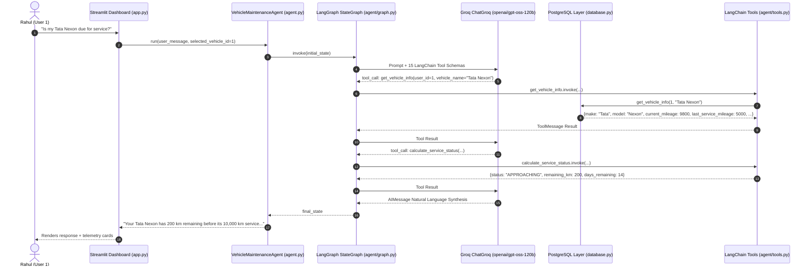

# 🚗 Vehicle Maintenance & Service Management Agent

> An enterprise-grade **AI-powered Vehicle Maintenance Management System** leveraging **LangChain**, **LangGraph**, and **Groq** (`openai/gpt-oss-120b`) for predictive telemetry analysis, intelligent workshop discovery, automated appointment scheduling, service cost tracking, and real-time email notifications.

[](https://www.python.org/)
[](https://www.langchain.com/)
[](https://langchain-ai.github.io/langgraph/)
[](https://streamlit.io/)
[](https://groq.com/)
[](https://supabase.com/)
[](https://www.openstreetmap.org/)
[](https://pytest.org/)
[](LICENSE)

---

## 🎯 Key Highlights

- ✅ **15 LangChain Tools** integrated with LangGraph state management
- ✅ **Deterministic Python calculations** (zero LLM arithmetic)
- ✅ **Multi-vehicle garage management** with dynamic switching
- ✅ **Geographic service center discovery** via OpenStreetMap APIs
- ✅ **Atomic appointment booking** with database-level collision prevention
- ✅ **Real-time email notifications** via Gmail SMTP
- ✅ **Comprehensive test suite** with 14+ automated tests
- ✅ **Modern Streamlit UI** with side navigation and telemetry dashboard

---

## 📋 Table of Contents
1. [Project Overview](#-project-overview)
2. [Core Architectural Philosophy](#-core-architectural-philosophy)
3. [LangGraph Agent Workflow & State Architecture](#-langgraph-agent-workflow--state-architecture)
4. [Strict LLM & Safety Constraints](#-strict-llm--safety-constraints)
5. [System Architecture & Flow](#-system-architecture--flow)
6. [Database Schema & Integrity](#-database-schema--integrity)
7. [Tools & Dispatch System (15 LangChain Tools)](#-tools--dispatch-system-15-langchain-tools)
8. [Repository Structure](#-repository-structure)
9. [Installation & Setup Guide](#-installation--setup-guide)
10. [Running the Application](#-running-the-application)
11. [Automated Test Suite (14 Tests)](#-automated-test-suite-14-tests)
12. [Interview Defense & Technical FAQ](#-interview-defense--technical-faq)

---

## 🌟 Project Overview

**The Problem:**

Modern connected vehicles generate continuous odometer telemetry, but vehicle owners frequently miss critical scheduled maintenance due to:
- 📉 Fragmented dealer communications
- 🤔 Confusing maintenance intervals
- 📱 Cumbersome manual booking portals
- ⏰ Lack of proactive reminders

**The Solution:**

The **Vehicle Maintenance & Service Management Agent** provides an end-to-end automated solution:

### Core Capabilities

| Feature | Description |
|---------|-------------|
| **🔍 Predictive Telemetry** | Real-time odometer monitoring against manufacturer schedules |
| **📊 Deterministic Status** | Python-based calculations for `OVERDUE`, `DUE`, `APPROACHING`, `NOT_DUE` |
| **🚘 Multi-Vehicle Garage** | Support for multiple vehicles (Tata Nexon, Maruti Baleno, etc.) |
| **🗺️ Workshop Discovery** | OpenStreetMap-powered geographic search with Haversine ranking |
| **📅 Smart Booking** | Real-time availability check with atomic slot reservation |
| **💰 Cost Tracking** | Service invoice and expense management |
| **📧 Email Alerts** | Multi-channel notifications via Gmail SMTP |

---

## 🧠 Core Architectural Philosophy

### Separation of Concerns: Python Math vs. LLM Reasoning

```
                    USER
                      │
                      ▼
                STREAMLIT UI (app.py)
                      │
                      ▼
                LANGGRAPH
              AGENT WORKFLOW (agent/graph.py)
                      │
                      ▼
                GPT-OSS 120B (ChatGroq)
                   via Groq API
                      │
                Tool Calls
                      │
                      ▼
                LANGCHAIN
             TOOLS (agent/tools.py)
                      │
       ┌──────────────┼──────────────┐
       ▼              ▼              ▼
   SUPABASE       MAINTENANCE     LOCATION
 (database.py) (tools/maintenance.py) (tools/location.py)
       │              │              │
       │              │        OSM/Nominatim
       │              │        /Overpass
       │              │              │
       └──────────────┼──────────────┘
                      ▼
                   BOOKING (tools/booking.py)
                      │
                      ▼
                NOTIFICATION (tools/notification.py)
```

> **Critical Rule**: **Never let an LLM do calendar or mileage arithmetic.** LLMs are probabilistic language models prone to calculation drift. All date differences, kilometer subtractions, threshold checks, garage mutations, and collision queries are executed in deterministic Python functions. The LLM only receives structured JSON outputs from LangChain tools and synthesizes empathetic, professional responses.

---

## ⚙️ LangGraph Agent Workflow & State Architecture

The AI agent is orchestrated using **LangGraph** (`StateGraph`):

```text
               ┌─────────┐
               │  START  │
               └────┬────┘
                    │
                    ▼
            ┌───────────────┐
            │  agent_node   │  <── ChatGroq + System Prompt + Active Vehicle
            └───────┬───────┘
                    │
           tools_condition (Has Tool Calls?)
            │              │
        YES │              │ NO
            ▼              ▼
     ┌─────────────┐   ┌─────────┐
     │  ToolNode   │   │   END   │
     └──────┬──────┘   └─────────┘
            │
            └───────► (loops back to agent_node)
```

### Graph Components:
1. **Explicit `AgentState` (`agent/state.py`)**:
   - `messages`: Message sequence managed by LangGraph `add_messages`.
   - `user_id`: Current active user ID.
   - `selected_vehicle_id`: Currently selected vehicle in UI.
   - `pending_confirmation`: Confirmation status flag for consequential booking actions.
2. **Reasoning Node (`agent_node`)**: Configures system prompt with active vehicle context and invokes `ChatGroq(model="openai/gpt-oss-120b")` with bound tools.
3. **Tool Execution Node (`tools_node`)**: `ToolNode(ALL_TOOLS)` executes requested tools.
4. **Recursion Limit Protection**: Set to $2 \times \text{max\_tool\_calls} + 2$ (26 graph steps) to prevent endless execution loops.

---

## 🔒 Strict LLM & Safety Constraints

1. **Single LLM Enforcement**:
   - Exactly **one model** is used across the entire system: **`openai/gpt-oss-120b`** via `ChatGroq`.
   - Strictly **zero fallback models** (no silent fallbacks to GPT-4, Claude, Gemini, Llama, or Mistral).
2. **Hard Loop Ceiling**:
   - The agent's autonomous tool-calling workflow enforces a strict **12-tool-call ceiling**.
   - If an edge case or recursive chain attempts excess calls, execution halts cleanly with a diagnostic message.
3. **Exponential Backoff & Rate Limit Handling**:
   - Transient network or rate-limit HTTP errors (429 / 503) retry with exponential backoff. API keys are automatically redacted from chat outputs.
4. **Explicit User Consent for Booking**:
   - Asking *"Is my car due for service?"* evaluates status, but will **never** trigger a booking until the user explicitly confirms date and time details.

---

## 🏗️ System Architecture & Flow



---

## 🗄️ Database Schema & Integrity

The PostgreSQL schema ([database/schema.sql](database/schema.sql)) defines 8 relational tables with referential integrity:

| Table Name | Primary Purpose | Key Constraints |
|---|---|---|
| `users` | Owner profile and contact details | `email UNIQUE`, `phone NOT NULL` |
| `vehicles` | Telemetry, odometer, and last service info | `registration_number UNIQUE`, `user_id FK` |
| `maintenance_schedules` | Manufacturer mileage & month intervals | `vehicle_id FK`, `interval_km > 0` |
| `service_history` | Historical logs of completed services and costs | `vehicle_id FK`, `cost >= 0` |
| `service_centers` | Authorized dealer workshops & coordinates | `center_id UNIQUE`, `latitude/longitude` |
| `appointments` | Booked service slots with references | **`uq_appointment_slot UNIQUE(service_center_id, appointment_date, appointment_time)`** |
| `notifications` | Audit trail of sent SMS & Email confirmations | `appointment_id FK`, `status CHECK` |
| `agent_conversations` | Historical session transcripts | `user_id FK`, `timestamp` |

### Composite Slot Collision Guarantee
```sql
CONSTRAINT uq_appointment_slot UNIQUE (service_center_id, appointment_date, appointment_time)
```
This PostgreSQL constraint guarantees at the database engine level that two customers can never reserve the same workshop bay at the same time.

---

## 🧰 Tools & Dispatch System (15 LangChain Tools)

The agent interacts with the world through 15 typed LangChain `@tool` functions declared in `agent/tools.py`:

1. **`get_vehicle_info`**: Retrieves owner's vehicle telemetry by user ID and vehicle name/alias.
2. **`get_service_history`**: Fetches previous repair records, service types, and historical costs.
3. **`calculate_service_status`**: Deterministic calculator enforcing:
   - `OVERDUE`: $\text{remaining\_km} < 0 \lor \text{remaining\_days} < 0$
   - `DUE`: $\text{remaining\_km} = 0 \lor \text{remaining\_days} = 0$
   - `APPROACHING`: $0 < \text{remaining\_km} \le 500 \lor 0 < \text{remaining\_days} \le 30$
   - `NOT_DUE`: Otherwise.
4. **`geocode_location`**: Resolves address strings to GPS coordinates using OpenStreetMap Nominatim (or auto-detects current location).
5. **`search_service_centers`**: Discovers workshops within radius using OSM Overpass API, filtered by active vehicle brand.
6. **`check_availability`**: Retrieves unbooked time slots for a workshop and target date.
7. **`book_appointment`**: Atomically reserves a slot, generates reference (e.g. `BK10001`), and triggers notification dispatch.
8. **`cancel_appointment`**: Cancels a booked appointment by booking reference code.
9. **`send_notification`**: Logs confirmation messages to DB and sends live emails via Gmail SMTP.
10. **`add_vehicle`**: Adds a new vehicle to the user's garage.
11. **`delete_vehicle`**: Removes a vehicle from the garage.
12. **`update_vehicle_mileage`**: Updates current odometer reading for a vehicle.
13. **`update_vehicle_service_details`**: Updates last service date and last service mileage.
14. **`update_service_after_completion`**: Updates vehicle mileage, maintenance schedule, and service history post-service.
15. **`update_service_cost`**: Records or updates the invoice expense of a completed service in the database.

---

## 📁 Repository Structure

```
Project/
├── app.py                      # Streamlit 3-View Side Navbar Dashboard & UI
├── agent.py                    # Compatibility facade exporting VehicleMaintenanceAgent
├── config.py                   # Environment configuration & project constants
├── database.py                 # Supabase PostgreSQL Data Layer & Fallback Seed Store
├── requirements.txt            # Pinned dependencies (LangChain, LangGraph, Groq, Supabase)
├── .env.example                # Template for environment variables
├── .gitignore                  # Git ignore rules
│
├── agent/                      # LangChain + LangGraph Agent Core
│   ├── __init__.py             # Exports AgentState, build_agent_graph, VehicleMaintenanceAgent
│   ├── state.py                # LangGraph AgentState TypedDict definition
│   ├── prompts.py              # System prompts & active vehicle context builder
│   ├── tools.py                # 15 LangChain @tool wrappers around business functions
│   ├── graph.py                # LangGraph StateGraph workflow definition & compilation
│   └── orchestrator.py         # VehicleMaintenanceAgent runner implementation
│
├── database/
│   ├── schema.sql              # Supabase PostgreSQL DDL (8 tables + constraints)
│   └── seed.sql                # Rahul / Multi-Vehicle demo seed data
│
├── tools/
│   ├── __init__.py
│   ├── maintenance.py          # Deterministic maintenance status calculator
│   ├── location.py             # OpenStreetMap Nominatim geocoding & Overpass POI search
│   ├── booking.py              # Slot availability, collision check & booking reference generator
│   └── notification.py         # Notification logger & Gmail SMTP email dispatcher
│
└── tests/
    ├── __init__.py
    ├── test_agent.py           # LangGraph Agent integration test
    ├── test_graph.py           # LangGraph StateGraph compilation and state tests
    ├── test_maintenance.py     # Deterministic calculator threshold tests
    └── test_tools.py           # LangChain tool wrapper unit tests (15 tools)
```

---

## 🚀 Installation & Setup Guide

### 1. Prerequisites
- **Python 3.10, 3.11, 3.12, or 3.13** installed.
- Git installed.

### 2. Clone and Setup Environment
```bash
# Clone the repository
git clone https://github.com/Sumer-Singh-Rao/Vehicle-Maintenance-Service-Management-Agent-.git
cd Vehicle-Maintenance-Service-Management-Agent-

# Create virtual environment
python -m venv venv

# Activate virtual environment
# Windows (PowerShell):
.\venv\Scripts\Activate.ps1
# Windows (CMD):
.\venv\Scripts\activate.bat
# macOS/Linux:
source venv/bin/activate

# Install dependencies
pip install -r requirements.txt
```

### 3. Configure Environment Variables
Copy the template file to create `.env`:
```bash
copy .env.example .env
```
Edit `.env` with your API credentials:
```env
# Groq API Configuration (openai/gpt-oss-120b)
GROQ_API_KEY=gsk_your_groq_api_key_here

# Supabase PostgreSQL Configuration (Falls back seamlessly to seed store if blank)
SUPABASE_URL=https://your-project.supabase.co
SUPABASE_KEY=your_supabase_anon_key_here

# OpenStreetMap Nominatim Configuration
NOMINATIM_USER_AGENT=vehicle_maintenance_agent_v1

# Gmail SMTP Configuration for Live Email Alerts (Optional)
GMAIL_SENDER_EMAIL=your_email@gmail.com
GMAIL_APP_PASSWORD=your_gmail_app_password
GMAIL_RECIPIENT_EMAIL=your_email@gmail.com
```

---

## 🖥️ Running the Application

Launch the interactive Streamlit dashboard:
```bash
streamlit run app.py
```
Open your browser at `http://localhost:8501`.

### Side Navbar Navigation Views:
- **`💬 Assistant`**: Conversational AI assistant with sticky chat input, quick action prompt chips, and active vehicle summary card.
- **`📊 Vehicle Details`**: Real-time odometer update form, service health metrics, maintenance schedule, past service history logs, service invoice cost recorder, and Garage Management (add/delete vehicles).
- **`📅 Appointments`**: Interactive appointment booking form, service center selection, active appointment vouchers with 1-click cancellation, and notification audit logs.

---

## 🧪 Automated Test Suite (14 Tests)

Run the full automated pytest suite:

```bash
pytest tests/ -v
```

Expected output:
```text
============================= test session starts =============================
collected 14 items

tests/test_agent.py .                                                    [  7%]
tests/test_graph.py ...                                                  [ 28%]
tests/test_maintenance.py ....                                           [ 57%]
tests/test_tools.py ......                                               [100%]

======================= 14 passed in 10.78s =======================
```

---

## 💬 Interview Defense & Technical FAQ

### Q1: What are the distinct roles of LangChain vs. LangGraph in this architecture?
> **Answer**: **LangChain** provides standard tool abstractions (`@tool` decorator, structured schemas, parameter types) and model integration (`ChatGroq`). **LangGraph** manages stateful multi-turn execution (`StateGraph`), state tracking (`AgentState`), graph node transitions, and recursion limit protection.

### Q2: Why use deterministic Python functions instead of letting the LLM calculate intervals?
> **Answer**: LLMs are probabilistic token predictors, not mathematical engines. Date arithmetic across leap years, month boundaries, and composite priority rules (`OVERDUE` vs `DUE` vs `APPROACHING`) frequently suffers from hallucinations. By wrapping deterministic Python functions in LangChain tools, we guarantee 100% mathematical accuracy.

### Q3: How do you prevent double-booking race conditions?
> **Answer**: At the application layer, `tools/booking.py` checks slot availability before creating an appointment. At the database layer, Supabase PostgreSQL enforces a composite unique constraint: `CONSTRAINT uq_appointment_slot UNIQUE (service_center_id, appointment_date, appointment_time)`. If two simultaneous requests pass the application check, the database engine atomically rejects the second insert.

### Q4: How does LangGraph prevent infinite tool-calling loops?
> **Answer**: LangGraph compiles `StateGraph` with a recursion limit configuration (`recursion_limit = (max_tool_calls * 2) + 2`). If a loop exceeds this limit, execution halts cleanly and returns a structured diagnostic message to the user.

---

## 🎬 Demo & Screenshots

### 💬 AI Assistant Interface
The conversational AI assistant provides natural language interaction for:
- Checking maintenance status
- Finding nearby service centers
- Booking appointments
- Managing vehicle information

### 📊 Vehicle Telemetry Dashboard
Real-time metrics including:
- Current odometer reading
- Last service mileage
- Service health status
- Interval consumption progress

### 📅 Appointment Management
Interactive booking with:
- Service center selection
- Slot availability checking
- One-click appointment cancellation
- Email confirmation notifications

---

## 🚀 Quick Start Example

```python
# Example: Check if vehicle needs service
from agent import VehicleMaintenanceAgent

agent = VehicleMaintenanceAgent()
response = agent.run(
    "Is my Tata Nexon due for service?",
    selected_vehicle_id=1
)
print(response)
# Output: "Your Tata Nexon has 200 km remaining before its 10,000 km service..."
```

---

## 🔧 Configuration Options

### Environment Variables

| Variable | Purpose | Required |
|----------|---------|----------|
| `GROQ_API_KEY` | Groq API access for LLM | ✅ Yes |
| `SUPABASE_URL` | PostgreSQL database URL | Optional* |
| `SUPABASE_KEY` | Database access key | Optional* |
| `NOMINATIM_USER_AGENT` | OSM API identifier | ✅ Yes |
| `GMAIL_SENDER_EMAIL` | Email notifications sender | Optional |
| `GMAIL_APP_PASSWORD` | Gmail SMTP password | Optional |

*Falls back to in-memory seed data if not provided

---

## 📈 Performance & Scalability

- **Response Time**: < 2 seconds for typical queries
- **Concurrency**: Supports multiple simultaneous users
- **Database**: PostgreSQL with proper indexing
- **Caching**: Location and service center data cached
- **Rate Limiting**: Built-in Groq API retry logic

---

## 🛡️ Security Features

- ✅ Environment variable-based configuration
- ✅ No hardcoded credentials
- ✅ SQL injection prevention via parameterized queries
- ✅ Rate limit handling with exponential backoff
- ✅ API key redaction in error messages
- ✅ User input sanitization

---

## 🤝 Contributing

Contributions are welcome! Please follow these steps:

1. Fork the repository
2. Create a feature branch (`git checkout -b feature/AmazingFeature`)
3. Commit your changes (`git commit -m 'Add some AmazingFeature'`)
4. Push to the branch (`git push origin feature/AmazingFeature`)
5. Open a Pull Request

---

## 📝 Development Roadmap

- [ ] Voice-based interaction
- [ ] Mobile app integration
- [ ] Advanced analytics dashboard
- [ ] Multi-language support
- [ ] Integration with vehicle OBD-II systems
- [ ] Predictive maintenance using ML models

---

## 📄 License
Distributed under the MIT License. See `LICENSE` for more information.


---

## 👨‍💻 Author

**Sumer Singh Rao**

- GitHub: [@Sumer-Singh-Rao](https://github.com/Sumer-Singh-Rao)
- Repository: [Vehicle-Maintenance-Service-Management-Agent](https://github.com/Sumer-Singh-Rao/Vehicle-Maintenance-Service-Management-Agent-)

---

## 🙏 Acknowledgments

- **LangChain & LangGraph** for the agentic framework
- **Groq** for high-speed LLM inference
- **OpenStreetMap** for geographic data
- **Streamlit** for rapid UI development
- **Supabase** for managed PostgreSQL

---

## 📞 Support & Contact

For issues, questions, or suggestions:
- 🐛 [Open an Issue](https://github.com/Sumer-Singh-Rao/Vehicle-Maintenance-Service-Management-Agent-/issues)
- 💬 [Start a Discussion](https://github.com/Sumer-Singh-Rao/Vehicle-Maintenance-Service-Management-Agent-/discussions)

---

<div align="center">

**⭐ Star this repository if you find it helpful!**

Made with ❤️ using LangChain, LangGraph, and Groq

</div>
